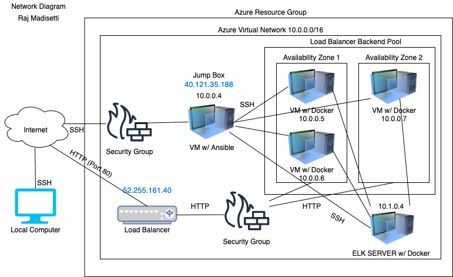
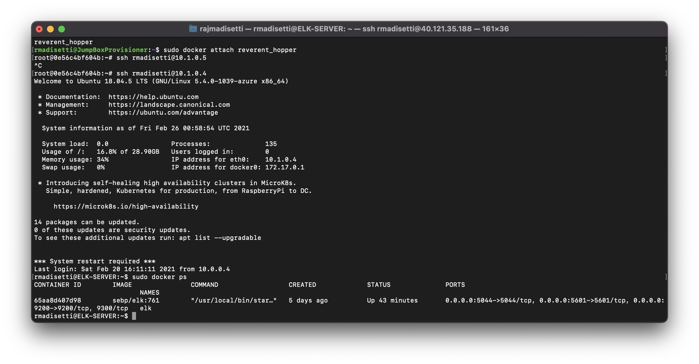

# ELKSERVER
## Automated ELK Stack Deployment

The files in this repository were used to configure the network depicted below.

These files have been tested and used to generate a live ELK deployment on Azure. They can be used to either recreate the entire deployment pictured above. Alternatively, select portions of the elk.yml file may be used to install only certain pieces of it, such as Filebeat.

This document contains the following details:
- Description of the Topology
- Access Policies
- ELK Configuration
  - Beats in Use
  - Machines Being Monitored
- How to Use the Ansible Build

### Description of the Topology

The main purpose of this network is to expose a load-balanced and monitored instance of DVWA, the D*mn Vulnerable Web Application.

Load balancing ensures that the application will be highly available, in addition to restricting inbound access to the network.

Integrating an ELK server allows users to easily monitor the vulnerable VMs for changes to the files of the VM's and system statistics, metrics, and other data.

The configuration details of each machine may be found below.

| Name     | Function | IP Address | Operating System |
|----------|----------|------------|------------------|
| Jump Box | Gateway  | 10.0.0.4   | Linux            |
| DVWA 1   | Web Server | 10.0.0.5 | Linux            |
| DVWA 2   | Web Server | 10.0.0.6 | Linux            |
| DVWA 3   | Web Server | 10.0.0.7 | Linux            |
| ELK      | Monitoring | 10.1.0.4 | Linux            |

### Access Policies

The machines on the internal network are not exposed to the public Internet.

Only the Jump Box machine can accept connections from the Internet. Access to this machine is only allowed from the following IP addresses: 40.121.35.188

Machines within the network can only be accessed by each other.

A summary of the access policies in place can be found in the table below.

| Name     | Publicly Accessible | Allowed IP Addresses |
|----------|---------------------|----------------------|
| Jump Box | Yes                 | 40.121.35.188        |
| ELK      | No                  | 10.1.0.1-254         |
| DVMA 1   | No                  | 10.0.0.1-254         |
| DVMA 2   | No                  | 10.0.0.1-254         |
| DVMA 3   | No                  | 10.0.0.1-254         |

### Elk Configuration

Ansible was used to automate configuration of the ELK machine. No configuration was performed manually, which is advantageous because Ansible allows users to modify playbooks in one place that configure particular programs to be installed and run on many machines.

The playbook implements the following tasks:
- Installs docker.io, pip3, and Docker python module to configure the ELK Server
- Increase the virtual memory and allocates more memory to the VM to allow it to run smoothly
- Downloads and launches the docker elk container using the sebp/elk:761 image

The following screenshot displays the result of running `docker ps` after successfully configuring the ELK instance.

### Target Machines & Beats
This ELK server is configured to monitor the following machines:
DVMA 1 - 10.0.0.5
DVMA 2 - 10.0.0.6
DVMA 3 - 10.0.0.7

We have installed the following Beats on these machines:
Filebeat
MetricBeat

These Beats allow us to collect the following information from each machine:
Filebeat: Filebeat is an application that collects the log files for a system, so if there are any changes to a file, Filebeat will log that data and send it to Kibana.
MetricBeat: MetricBeat collects statistics and metrics from a machine and sends it to Kibana. It looks for any fluctuations in CPU usage and reports it.

### Using the Playbook
In order to use the playbook, you will need to have an Ansible control node already configured. Assuming you have such a control node provisioned:

SSH into the control node and follow the steps below:
- Copy the playbook file to Ansible control node.
- Update the /etc/ansible/hosts/ file to include all of your VMs.
- Run the playbook, and navigate to http://168.62.217.240:5601/app/kibana/ to check that the installation worked as expected.
